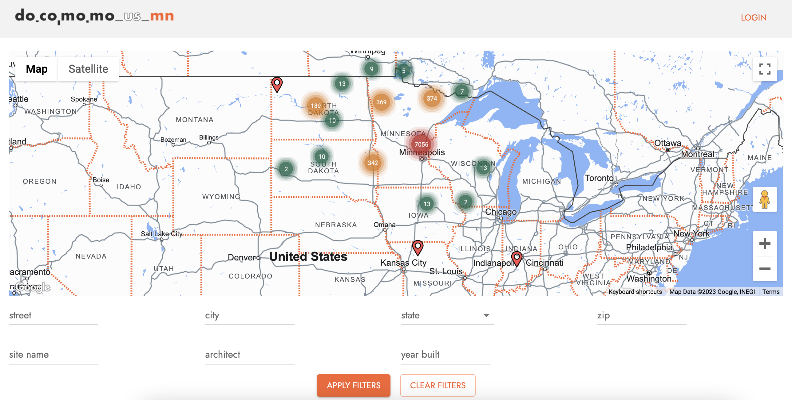
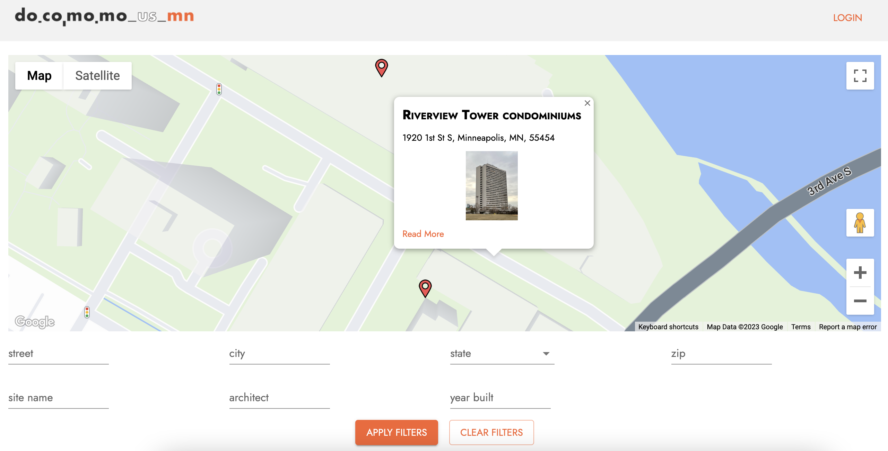
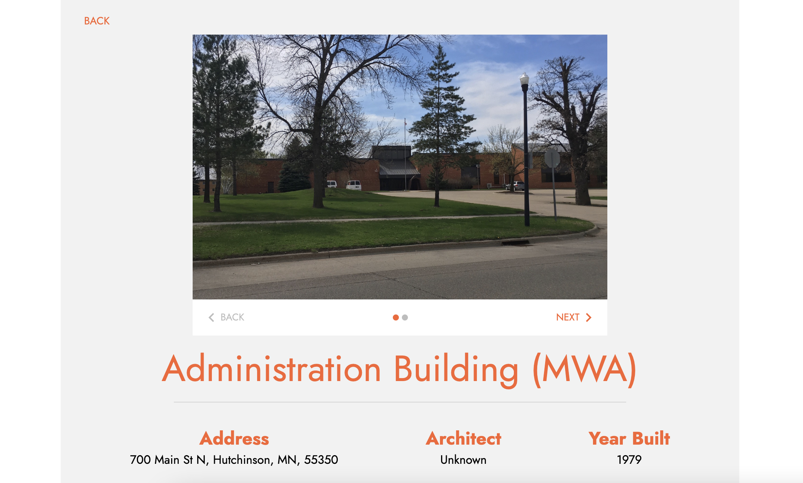

# Docomomo MN / US Modern Registry Map

Docomomo MN's Minnesota Modern Registry documents the wide array of buildings, sites, and neighborhoods of the modern movement in the state of Minnesota. Our team from Prime Digital Academy upgraded the initial version of the map with the following: 

* Responsive design that is mobile friendly
* Clustering of sites allows for easier navigation and reduced delay on map load
* Dynamic map filters, searches, site details page, and SQL queries allowing for an expandable database
* Individual pages for each site with details
* Login allows administrators to edit, add, and delete sites from database

[Live Deployed Site](https://docomomo-mn-modern-registry-28e0f754dd03.herokuapp.com/#/home)

## Screenshots

### Landing Page


### Info Window 


### Details Page


## Getting Started

These instructions will get you a copy of the project up and running on your local machine for development and testing purposes.

### Prerequisites

Before you get started, make sure you have the following software installed on your computer and have completed all tasks:

- [Node.js](https://nodejs.org/en/)
- [PostrgeSQL](https://www.postgresql.org/)
- [Nodemon](https://nodemon.io/)
- Create a [Google Maps Platform account](https://console.cloud.google.com/google/maps-apis/start?utm_source=Docs_GS_Button&ref=https://developers.google.com/maps/&utm_content=Docs_Central) and find your unique API key

### Installing

* First, make a fork or template of this repository and clone it down to your machine
* Run `npm install`
* Create a `.env` file at the root of the project and add the following variables:
```
  SERVER_SESSION_SECRET= a randomly generated strong password goes here
  REACT_APP_GOOGLE_MAPS_API_KEY= your API key goes here
```
* Set up your databases using the statements in the database folder
* Start postgres if not running
* Run `npm run server`
* Run `npm run client`

## Deployment

1. Create a new Heroku project
1. Link the Heroku project to the project GitHub Repo
1. Create an Heroku Postgres database
1. Connect to the Heroku Postgres database from Postico
1. Create the necessary tables
1. Add an environment variable for `SERVER_SESSION_SECRET` with a nice random string for security
1. Add an environment variable for `REACT_APP_GOOGLE_MAPS_API_KEY` with your Google Maps API key
1. In the deploy section, select manual deploy

## Built With

* [Node.js](https://nodejs.org/en/)
* [Express](https://expressjs.com/)
* [React](https://react.dev/)
* [Redux](https://redux.js.org/)
* [Material UI](https://mui.com/)
* [Postgres](https://www.postgresql.org/)
* [Google Maps API](https://developers.google.com/maps/documentation/javascript)

## Authors

* **Prime Digital Academy** - *Starter Repo* - [Prime Digital Academy](https://www.primeacademy.io/)
* **Daniel Davidson** - [Github Profile](https://github.com/dmrd2653)
* **Luke Gartner** - [Github Profile](https://github.com/lukegartner)
* **Javier Navarro** - [Gibhub Profile](https://github.com/Javierna182)
* **Maya Peters** - [Github Profile](https://github.com/mayaavida)
* **Jose Sanchez** - [Gibhut Profile](https://github.com/Astronaut)

## Acknowledgments

* Thank you to [Prime Digital Academy](https://www.primeacademy.io/) whose starter repo we used!
* Thank you to our instructors, Zac Delventhal, Chris Black, and Peter DeMaio
* Thank you to the rest of our Topaz cohort!!

